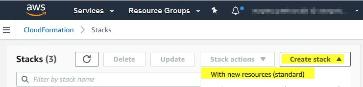
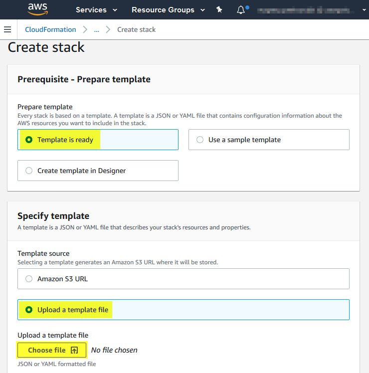

# Minimale Testumgebung über CloudFormation & cfn-init

## Was macht es?
Über CloudFormation Template wird eine EC2 Instanz (Amazon Linux) ausgerollt.
Instanz nutzt *cfn-init* um *Metadata* aus Template auszulesen, Installationsskripte (*files*) anzulegen, sie auszuführen (*commands*) und Systemd Service zu konfigurieren / zu starten

## Wie kann ich es ausrollen?
Dazu gibt es 2 Möglichkeiten:

. *deploy.sh* Skript anzupassen und auszuführen. Voraussetzungen:
.. AWS Cli Installation
.. AWS Credentials
... AWS_ACCESS_KEY_ID
... AWS_SECRET_ACCESS_KEY
. CF-Stack über AWS Konsole auszurollen

## Rollout über deploy Skript
### AWS cli installieren
https://docs.aws.amazon.com/de_de/cli/latest/userguide/cli-chap-install.html

### deploy.sh Skript anpassen
----
imageId='<insert-ami-id-here>' \
instanceSize='t2.micro' \
keyName='<insert-aws-keypair-name-here>' \
subnetId='<insert-aws-subnet-id-here>' \
vpcId='<insert-aws-vpc-id-here>'
----

### Cerdentials für Zugriff einrichten
https://docs.aws.amazon.com/de_de/cli/latest/userguide/cli-chap-configure.html

## Rollout über AWS Konsole
### Durchklicken

### Werte für die Parameter angeben

[IMPORTANT]
====
es ist vorausgesetzt das Amazon Machine Image *cfn-init* und *yum* unterstützt
====

.CF Parameter
|===
|Parameter |Beispielwert | Beschreibung

|imageId
|ami-0ec1ba09723e5bfac
|Amazon Machine Image

|instanceSize
|t2.micro
|Amazon EC2 Instance-Typ

|keyName
|my-keypair-name
|Amazon EC2-Schlüsselpaare

|subnetId
|subnet-abc0ffa3
|VPC-Subnetz

|vpcId
|vpc-e1c12345
|Amazon Virtual Private Cloud (VPC) Id

|telegramBotToken
|1234567890:AbCD...
|selbsterklärend 😄

|===

### FAQ

[qanda]
Wo ist auf EC2 Applikation installiert?::
  /opt/humanbios/telegram_bot_frontend
Wo ist Installation-Log?::
  /var/log/cfn-init-cmd.log
Wo sind Appliaktion Logs?::
/opt/humanbios/telegram_bot_frontend/logs/
Wie prüfe ich ob Service läuft?::
systemctl status telegrambot.service
Wie übergebe ich Zugriff-Token beim Rollout?::
* Beim Deploy Skript Aufruf
----
./deploy.sh
1234567890:IchBinEinTokenDerNichtExsitiert
----
* Bei CF-Stack Rollout über *NoEcho* Parameter *telegramBotToken*

### Was ist noch offen
* [ ] AMI -Härtung
* [ ] Rollout über Docker
* [ ] Betrachtung und Umsetzung Alternativlösungen - ECS oder Serverless oder...
